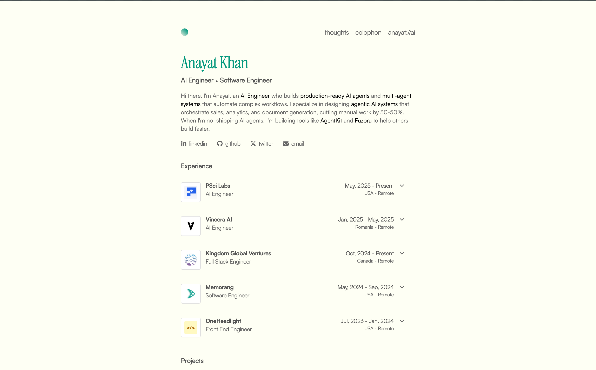

A minimal personal portfolio for Anayat Khan—AI Engineer & Software Engineer. Experience, projects, blog (thoughts), resume, and an AI chat to get to know more. Built with Astro, React, and Tailwind.



## Features

- **Experience & Projects** — Work history and project links with GitHub source.
- **Thoughts** — MDX blog for articles and notes.
- **Resume** — Inline PDF preview and download.
- **anayat://ai** — Chat with an AI persona about Anayat (Google Gemini + Vercel AI SDK).
- **Book a call** — Cal.com embed for intro calls.
- **Skills** — Bento-style skills grid by category.

## Built with

- [Astro](https://astro.build/) 
- [React](https://react.dev/)
- [TypeScript](https://www.typescriptlang.org/)
- [Tailwind CSS](https://tailwindcss.com/)
- [Vercel AI SDK](https://sdk.vercel.ai/)
- [MDX](https://mdxjs.com/)
- [Cal.com](https://cal.com/) (scheduling)
- [Vercel](https://vercel.com/) (hosting)

## Getting started

**Prerequisites:** Node.js 18+, bun (or npm/pnpm).

```bash
git clone https://github.com/anayatkhan1/your-repo.git
cd your-repo
bun install
bun run dev
```

Open [http://localhost:4321](http://localhost:4321).

## Environment Variables

To run the project locally, you need to set up the following environment variables. Create a `.env.local` or `.env` file in the root directory of the project:

```env
# Anthropic AI
ANTHROPIC_API_KEY=your_anthropic_api_key

#  Production URL
SITE=your_site_link
```

## License

MIT. See [LICENSE](LICENSE).

---

Built by [Anayat Khan](https://anayat.xyz)
